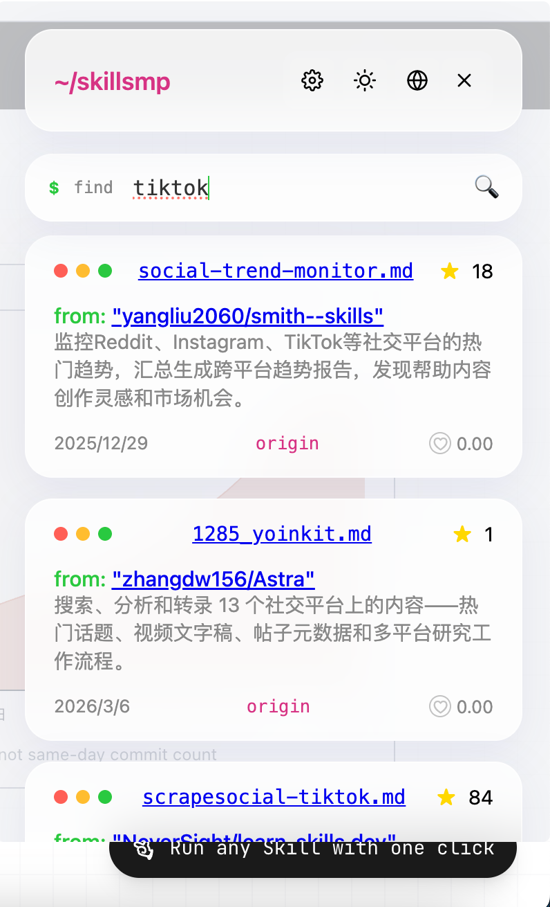
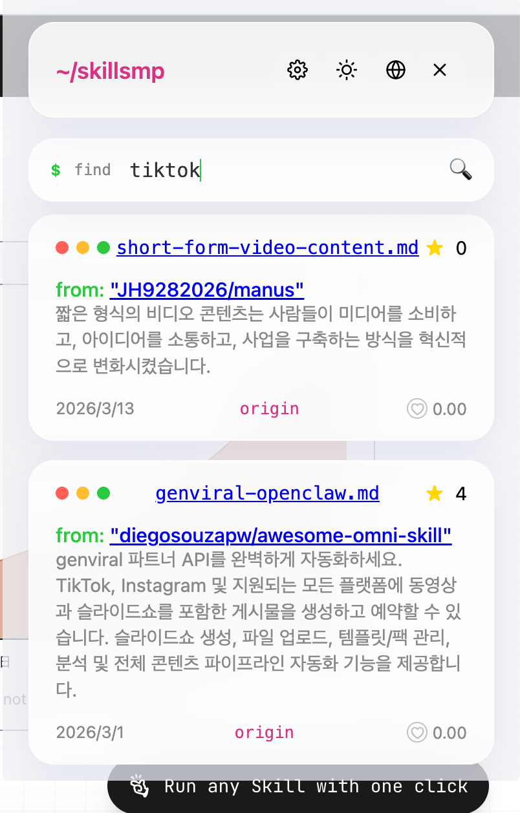
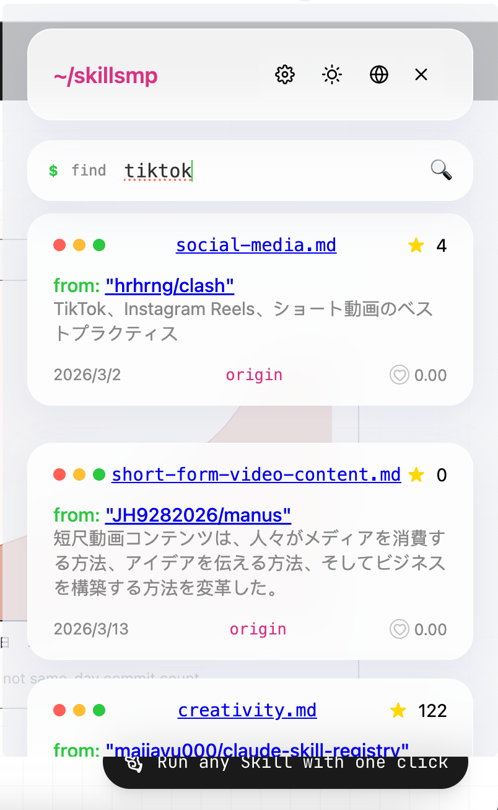
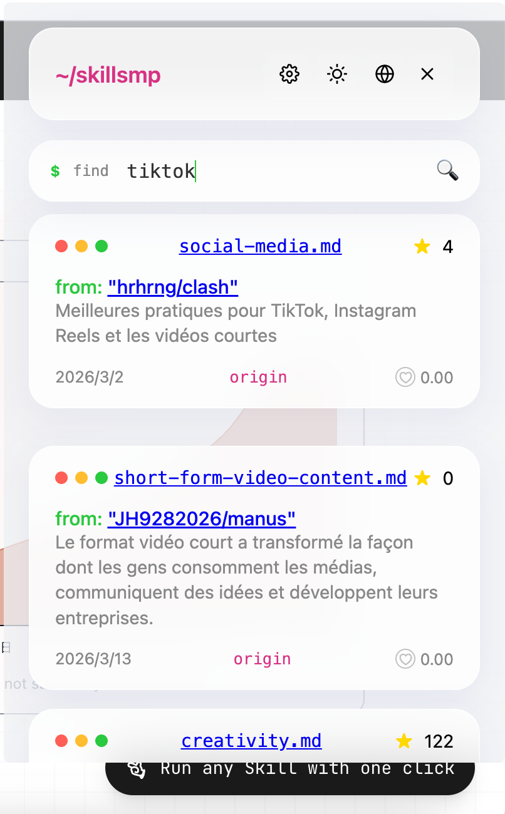
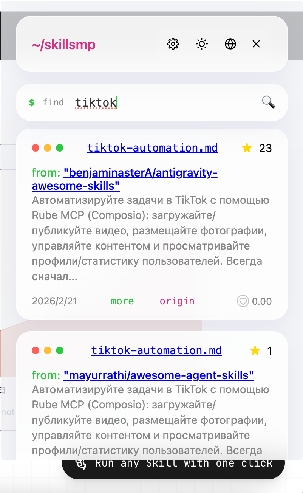

# skillmp-search

<div align="center">

[中文](README.md) | [English](README_EN.md)

</div>

> 基于 Vite + Vue3 + TypeScript 开发的 Chrome 扩展，提供智能技能(skills)搜索和语言切换功能(自动翻译搜索结果)

## 🌟 功能特性

- **智能搜索**：连接 skillsmp.com API，实时搜索开源技能项目
- **多语言支持**：支持 17 种语言切换（中文、英文、日文、韩文等）
- **自动翻译**：集成 Google Translate API，自动翻译项目描述
- **无限滚动**：加载更多搜索结果，流畅的浏览体验
- **主题切换**：支持亮色/暗色主题模式
- **排序功能**：按相关度、星级、最后更新时间排序
- **设置管理**：可配置 Target Limit、API Key、Google Translate API Key

## 📸 演示截图


### 搜索结果

<div>
	
  
  
  
  
</div>

## 📦 技术栈

- **框架**：Vue 3 (Composition API)
- **语言**：TypeScript
- **构建工具**：Vite
- **样式**：SCSS
- **扩展规范**：Chrome Extension Manifest V3

## 🚀 快速开始

### 环境要求

- Node.js >= 14.18.0
- Chrome/Edge 浏览器

### 安装依赖

```bash
npm install
```

### 开发模式

```bash
npm run dev
```

启动后访问 `http://localhost:3000` 预览页面效果。

### 打包构建

```bash
npm run build
```

构建产物将输出到 `build/` 目录。

## 🔧 安装扩展

### 方式一：从 GitHub Release 安装（推荐）

1. 访问 [GitHub Releases](https://github.com/iss-tools/skillmp-search/releases)
2. 下载最新版本的 `.zip` 或 `.crx` 文件
3. 打开 Chrome 浏览器，进入 `chrome://extensions/`
4. 开启右上角的 **"开发者模式"**
5. 如果是 `.zip` 文件：
   - 解压下载的压缩包
   - 点击 **"加载已解压的扩展程序"**
   - 选择解压后的文件夹
6. 如果是 `.crx` 文件：
   - 直接将 `.crx` 文件拖拽到扩展管理页面
   - 点击 **"添加扩展程序"**

### 方式二：开发者模式安装

1. 打开 Chrome 浏览器，进入 `chrome://extensions/`
2. 开启右上角的 **"开发者模式"**
3. 点击 **"加载已解压的扩展程序"**
4. 选择项目中的 `build` 文件夹

### 生产部署

构建完成后，`build` 目录包含完整的扩展文件，可直接提交到 Chrome Web Store。

参考官方指南：[Chrome Web Store 发布指南](https://developer.chrome.com/webstore/publish)

## ⚙️ 配置说明

### 设置项

在扩展的 Options 页面可以配置以下参数：

| 设置项 | 说明 | 默认值 |
|--------|------|--------|
| Target Limit | 每次搜索返回的结果数量 | 50 |
| API Key | skillsmp.com API 密钥 | - |
| Google Translate API Key | 翻译服务 API 密钥 | - |
| Sort By | 排序方式 | Relevance |

### 排序选项

- **Relevance** - 按相关度排序
- **Stars** - 按星级排序
- **Last Updated** - 按最后更新时间排序

### 支持的编程语言

| 代码 | 名称 | 旗帜 |
|------|------|------|
| zh-CN | 简体中文 | 🇨🇳 |
| zh-TW | 繁體中文 | 🇹🇼 |
| en | English | 🇺🇸 |
| ko | 한국어 | 🇰🇷 |
| ja | 日本語 | 🇯🇵 |
| fr | Français | 🇫🇷 |
| ru | Русский | 🇷🇺 |
| de | Deutsch | 🇩🇪 |
| id | Bahasa Indonesia | 🇮🇩 |
| tl | Tagalog | 🇵🇭 |
| sq | Shqip | 🇦🇱 |
| tr | Türkçe | 🇹🇷 |
| my | မြန်မာဘာသာ | 🇲🇲 |
| th | ไทย | 🇹🇭 |
| vi | Tiếng Việt | 🇻🇳 |
| pl | Polski | 🇵🇱 |
| pt | Português | 🇵🇹 |

## 📁 项目结构

```
skillmp-search/
├── src/
│   ├── popup/              # 弹窗页面
│   │   ├── index.ts        # 入口文件
│   │   └── Popup.vue       # 主组件
│   ├── options/            # 设置页面
│   │   ├── index.ts        # 入口文件
│   │   ├── Options.vue     # 主组件
│   │   ├── types.ts        # 类型定义
│   │   └── options.scss    # 样式变量
│   ├── contentScript/      # 内容脚本
│   │   ├── index.ts        # 入口文件
│   │   └── App.vue         # 主组件
│   ├── background/         # 后台脚本
│   │   └── index.ts
│   ├── manifest.ts         # 扩展配置
│   └── assets/             # 静态资源
├── build/                  # 构建输出目录
├── public/                 # 公共资源
├── package.json
├── vite.config.ts
└── tsconfig.json
```

## 🔑 API 密钥获取

### skillsmp API Key

1. 访问 [skillsmp.com](https://skillsmp.com)
2. 注册账号并获取 API 密钥

### Google Translate API Key

1. 访问 [Google Cloud Console](https://cloud.google.com/)
2. 创建项目并启用 Translation API
3. 创建凭据获取 API 密钥

## 🛠️ 开发指南

### 调试模式

#### 弹窗页面调试
访问 `http://localhost:3000/popup.html`

#### 设置页面调试
访问 `http://localhost:3000/options.html`

### 格式化代码

```bash
npm run fmt
```

### 预览构建

```bash
npm run preview
```

## 📝 更新日志

### v0.0.0
- ✨ 初始版本发布
- 🎯 实现智能技能搜索功能
- 🌐 支持 17 种语言切换
- 🔄 集成 Google 翻译 API
- 🌓 支持亮色/暗色主题
- 📊 支持多种排序方式

## 📄 许可证

MIT License

## 🤝 贡献

欢迎提交 Issue 和 Pull Request！

## 🔗 相关链接

- [Chrome Extension 开发文档](https://developer.chrome.com/docs/extensions/)
- [Vue 3 官方文档](https://vuejs.org/)
- [Vite 官方文档](https://vitejs.dev/)
- [skillsmp.com](https://skillsmp.com)
- [GitHub Releases](https://github.com/iss-tools/skillmp-search/releases)

---

Built with ❤️ using Vue 3 + TypeScript
